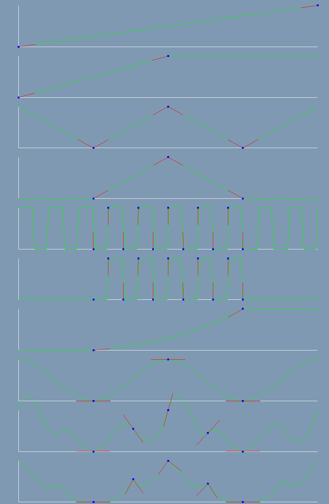
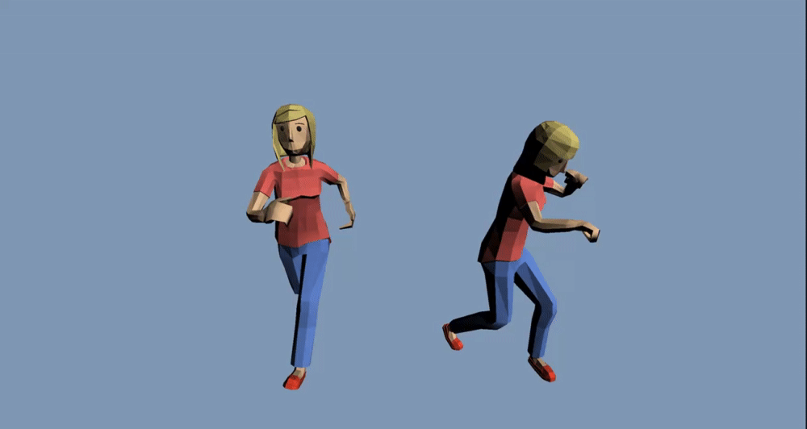
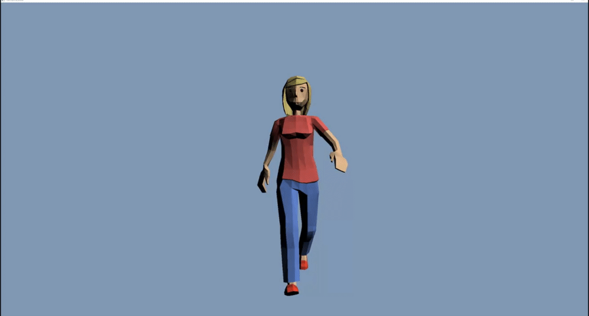
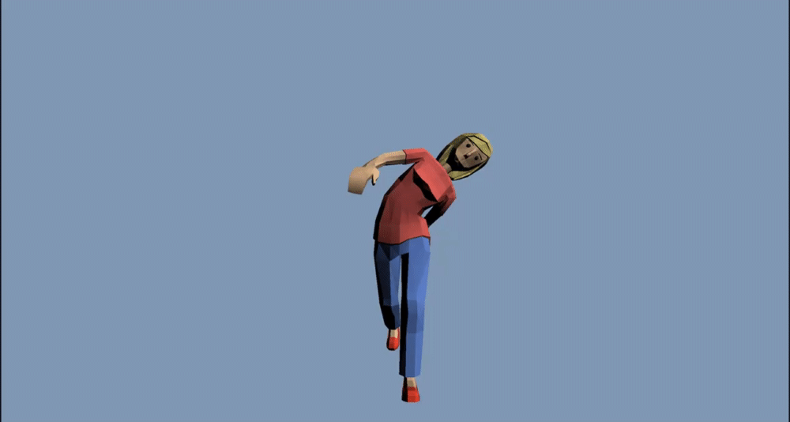
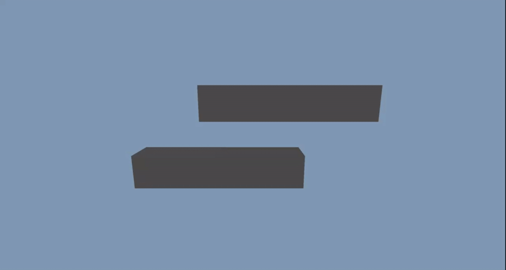
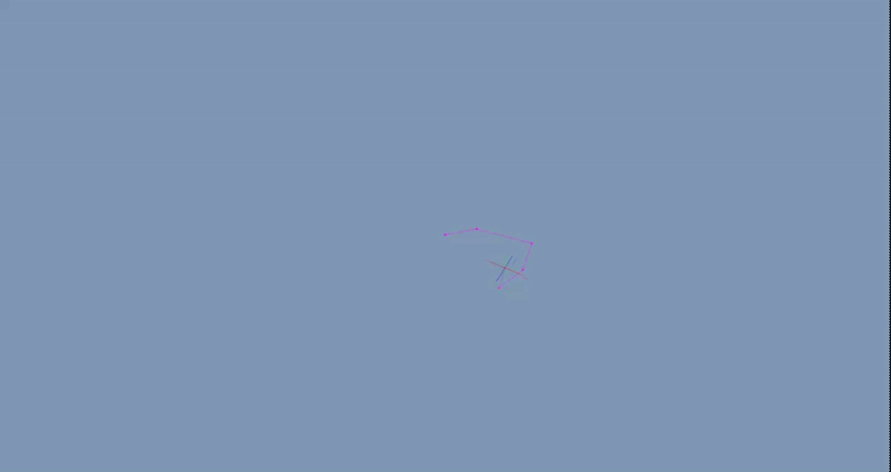

# C++ Game Animation

This repo is the implementation of the book [Hands-On C++ Game Animation Programming](https://www.packtpub.com/product/hands-on-c-game-animation-programming/9781800208087).

It contains several Application examples:

|                  Float curves interpolation                  |           Skeletal Mesh animation GPU/CPU           |
|:------------------------------------------------------------:|:---------------------------------------------------:|
|     |   |
|                **Blends between animations**                 |            **Additive blend animation**             |
|                   |  |
|         **Dual quaternion blend skinning vs linear**         |                  **FABRIK Solver**                  |
|  |         |
|                     **Character leg IK**                     |                  **Crowd Shader**                   |
|                      |          |

